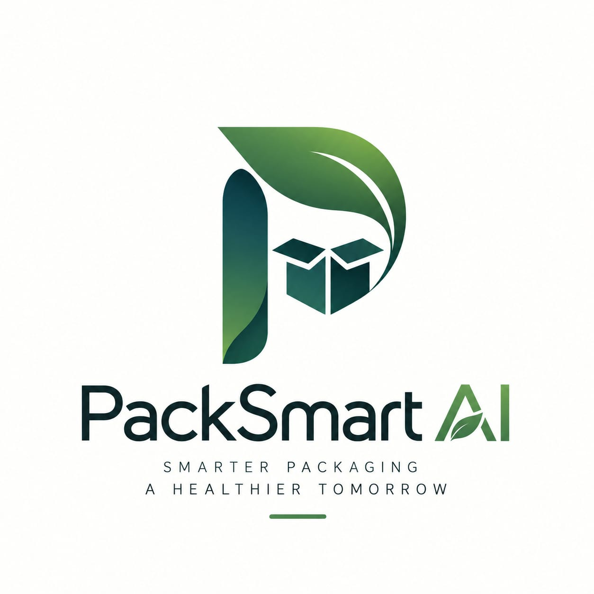

<p align="center">
  
</p>

<h1 align="center">🌿 PackSmart AI</h1>

<p align="center">
  <b>Smarter Packaging · A Healthier Tomorrow</b><br>
  <i>Enterprise AI SaaS & ASTM Barrier Physics Platform for Food Preservation, Shelf-Life Optimization, and Sustainable Packaging Specification</i>
</p>

<p align="center">
  
  
  
  
  
  
  
  
  
</p>

---

## 📋 Table of Contents

- [Executive Overview](#-executive-overview)
- [📖 User Manual & Operating Guide (USER_MANUAL.md)](./USER_MANUAL.md)
- [System Architecture](#-system-architecture)
- [Key Features & Platform Modules](#-key-features--platform-modules)
- [Role-Based Access Control (RBAC)](#-role-based-access-control-rbac)
- [Scientific & Physical Engineering Engines](#-scientific--physical-engineering-engines)
  - [1. ASTM Barrier Permeation Physics (OTR & WVTR)](#1-astm-barrier-permeation-physics-otr--wvtr)
  - [2. Coupled Arrhenius Degradation Kinetics](#2-coupled-arrhenius-degradation-kinetics)
  - [3. Equilibrium Modified Atmosphere Packaging (EMAP)](#3-equilibrium-modified-atmosphere-packaging-emap)
  - [4. True Packaging Unit Economics](#4-true-packaging-unit-economics)
  - [5. Quantitative LCA Circularity & Net Carbon](#5-quantitative-lca-circularity--net-carbon)
  - [6. Multi-Objective Constrained Pareto Optimization](#6-multi-objective-constrained-pareto-optimization)
- [Decision Intelligence: "Why this material?"](#-decision-intelligence-why-this-material)
- [AI Processing Pipeline & Loading States](#-ai-processing-pipeline--loading-states)
- [Resilience & Fault-Tolerant Error Handling](#-resilience--fault-tolerant-error-handling)
- [Systematic Scenario Test Matrix](#-systematic-scenario-test-matrix)
- [Machine Learning Model Information](#-machine-learning-model-information)
- [REST API Reference](#-rest-api-reference)
- [Quickstart & Installation](#-quickstart--installation)
- [License](#-license)

---

## 🌟 Executive Overview

In commercial food manufacturing and FMCG packaging, material selection has historically relied on trial-and-error, qualitative supplier marketing terms ("High / Medium Barrier"), or static spreadsheets. This leads to two costly failure modes:

1. **Under-packaging**: Trimming $\$0.01$ from barrier film specifications triggers moisture absorption, crispness loss, or lipid rancidity, causing **over $\$0.25$ per pack in spoilage write-offs and brand erosion**.
2. **Over-packaging**: Over-specifying non-recyclable multi-material foils for short ambient distribution items inflates polymer resin spending and increases carbon liabilities.

**PackSmart AI** integrates food biochemistry, thermodynamic transport physics, and multi-objective machine learning to calculate exact, physically derived barrier thresholds:

- **$\text{OTR}_{\max}$** in $\text{cc}/(\text{m}^2 \cdot \text{day} \cdot \text{atm})$ via lipid auto-oxidation rates and respiration Michaelis-Menten kinetics.
- **$\text{WVTR}_{\max}$** in $\text{g}/(\text{m}^2 \cdot \text{day})$ via water activity ($a_w$), Guggenheim-Anderson-de Boer (GAB) sorption isotherms, and Tetens vapor differentials.

Every candidate substrate is evaluated under **Arrhenius temperature-scaled permeation** with verified **PASS / FAIL** status, safety buffer margins, Equilibrium MAP gas mixtures, unit packaging economics, and cradle-to-gate LCA carbon offsets.

---

## 🏗️ System Architecture

```
                                      PACKSMART AI PLATELINE
                                                 │
   ┌─────────────────────────────────────────────┴─────────────────────────────────────────────┐
   ▼                                                                                           ▼
[ Frontend Architecture (React 18 + Vite) ]                                 [ Backend Engine (FastAPI + Python 3.13) ]
• Modern Dark Packaging SaaS Design System                                  • ASTM D3985 & F1249 Permeation Physics
• 5-Step Guided Recommendation Wizard                                       • Arrhenius Kinetic Shelf-Life Predictor
• Arrhenius Q10 Interactive Decay Visualizer                                • EMAP Respiration & Micro-Perforation Solver
• Multi-Tab "What-If" Scenario Simulator                                   • Multi-Objective Constrained Pareto Optimizer
• PDF Technical Report Generation & Export                                  • Scikit-Learn Suitability Pipeline
• Client-Side Mass Feasibility Validation                                   • Supabase PostgreSQL Client & Auth Guards
• Application Recovery Shield (Error Boundary)                              • Resilient Fallback Engine & Health Probes
```

---

## ⚡ Key Features & Platform Modules

* **5-Step Analysis Wizard**:
  * **Step 01 / Food Profile**: Biochemical commodity presets (moisture, lipids, pH, respiration) with custom property calibration.
  * **Step 02 / Conditions**: Ambient temperature ($-30^\circ\text{C}$ to $70^\circ\text{C}$), relative humidity, target shelf-life counter, package weight, and logistics mode with live Arrhenius $Q_{10}$ kinetic decay curves.
  * **Step 03 / Packaging Selection**: Quick substrate selection with ASTM property badges and instantaneous click feedback.
  * **Step 04 / AI Analysis Pipeline**: Dedicated 6-stage loading sequence with animated neural core, progress tracker, and live computation telemetry.
  * **Step 05 / Results & Decision Intelligence**: Complete Pareto cards (Options A–D), circular progress ring, "Why this material?" explanation block, and technical ASTM compliance matrix.
* **What-If Scenario Simulator**:
  * Real-time sensitivity simulation across shifting temperatures, humidity spikes, microbial baselines, and mono-materials.
  * Multi-tab analysis: Shelf-Life Kinetics, Produce Respiration & EMAP, MAP Gas Formulation, and Scenario Sweep.
* **Analysis History**: User-isolated historical records with re-run capability, search, and CSV export.
* **Materials Comparison Matrix**: Interactive side-by-side benchmarking of 8 certified packaging substrates with radar plots.
* **PDF Specification Export**: Standardized engineering assessment reports ready for laboratory sign-off and printing.
* **Administrative Portals**:
  * **Management Portal**: Food and material catalog management with operational oversight.
  * **Super Admin Portal**: Complete user management, role elevation controls, and real-time security audit trails.

---

## 🛡️ Role-Based Access Control (RBAC)

PackSmart AI enforces an enterprise 3-tier hierarchical security topology with server-side authorization checks on all mutating API calls:

```
                            👑 SUPER ADMIN
                          Full System Access
                                  │
                                  ▼
                          🛠️ SYSTEM MANAGER
                          Management Access
                                  │
                                  ▼
                               👤 USER
                             Basic Access
```

### Access Tiers & Privileges

| Role | Access Scope | Key Capabilities & Enforced Privileges |
| :--- | :--- | :--- |
| **👑 Super Admin** | **Full System Access** | **Unrestricted root administration across all domains:**<br>• User management & role assignment<br>• System Manager oversight<br>• Complete database access (materials, foods, history)<br>• System security audit logs inspection<br>• Platform configurations & security policies |
| **🛠️ System Manager** | **Management Access** | **Operational management & catalog oversight:**<br>• Everything a User can access<br>• View all user recommendations & reports<br>• Modify packaging materials & food catalog presets<br>• Access management dashboards |
| **👤 User** | **Basic Access** | **Packaging analysis & exploration:**<br>• 5-step Recommendation Wizard<br>• What-If Simulator<br>• Materials comparison matrix<br>• Personal recommendation history<br>• PDF report generation |

### Demo Accounts (1-Click Switch in Application Header)

| Persona | Role | Email | Password | Pre-Assigned Privileges |
| :--- | :--- | :--- | :--- | :--- |
| **Sarah Chen** | 👑 Super Admin | `admin@packsmart.ai` | `admin` | Full System Access (17 Privileges) |
| **Marcus Vance** | 🛠️ System Manager | `manager@packsmart.ai` | `manager` | Management Access (12 Privileges) |
| **Alex Rivera** | 👤 Standard User | `user@packsmart.ai` | `user` | Basic Access (6 Privileges) |

---

## 🔬 Scientific & Physical Engineering Engines

### 1. ASTM Barrier Permeation Physics (OTR & WVTR)

PackSmart AI computes exact gas and vapor ingress thresholds based on ASTM standards:

#### Permissible Oxygen Transmission Rate (ASTM D3985):
$$\Delta [O_2]_{\text{crit}} = W_{\text{fat}} \times \text{Uptake Limit} \quad [\text{cc } O_2]$$

$$\text{OTR}_{\text{req}} = \frac{\Delta [O_2]_{\text{crit}}}{A \times \theta \times \Delta P_{O2} \times k_{\text{temp}}} \quad \left[\frac{\text{cc}}{\text{m}^2 \cdot \text{day} \cdot \text{atm}}\right]$$

#### Permissible Water Vapor Transmission Rate (ASTM F1249):
$$\Delta M_{\text{crit}} = \frac{|M_{\text{crit}} - M_0|}{100} \times W_{\text{food}} \quad [\text{grams } H_2O]$$

$$\text{WVTR}_{\text{req}} = \frac{\Delta M_{\text{crit}}}{A \times \theta} \times \frac{\Delta RH_{\text{ASTM}}}{\Delta RH_{\text{ambient}}} \times \frac{1}{P_{\text{sat}}(T)/P_{\text{sat}}(38^\circ\text{C})} \quad \left[\frac{\text{g}}{\text{m}^2 \cdot \text{day}}\right]$$

---

### 2. Coupled Arrhenius Degradation Kinetics

Evaluates three competing degradation pathways to pinpoint the rate-limiting spoilage mechanism:

$$\theta_{\text{shelf}} = \min(\theta_{\text{microbial}},\; \theta_{\text{oxidation}},\; \theta_{\text{moisture}})$$

* **Microbial Spoilage ($\theta_{\text{microbial}}$)**: Ratkowsky square-root growth kinetics factoring storage temperature, water activity ($a_w$), pH, initial microbial load ($N_0$), and dissolved headspace $CO_2$.
* **Lipid Oxidation ($\theta_{\text{oxidation}}$)**: Coupled Fickian oxygen permeation integrated with Arrhenius peroxide decomposition kinetics.
* **Moisture Staling ($\theta_{\text{moisture}}$)**: Water vapor sorption driving crispness loss or moisture caking.

---

### 3. Equilibrium Modified Atmosphere Packaging (EMAP)

For live respiring produce, PackSmart AI solves the dynamic respiration-permeation balance:

$$\text{OTR}_{\text{produce}} = \frac{R_{O2}(T) \times W_{\text{kg}} \times 24}{A \times (0.21 - [O_2]_{\text{target}})} \quad \left[\frac{\text{cc}}{\text{m}^2 \cdot \text{day} \cdot \text{atm}}\right]$$

* **Fresh Produce EMAP**: Balances $O_2$ ($3\text{--}5\%$) and $CO_2$ ($4\text{--}7\%$) to suppress senescence without causing anaerobic fermentation ($< 2\%\text{ O}_2$).
* **Dry Foods & Snacks**: Nitrogen flush ($O_2 \le 0.2\%$, $N_2 \ge 99.8\%$) providing an inert cushion against rancidity and physical crushing.
* **Chilled Dairy & Cheese**: Bacteriostatic carbon dioxide flush ($O_2 \le 0.1\%$, $CO_2 = 30\%$, $N_2 = 70\%$).

---

### 4. True Packaging Unit Economics

Calculates commercial exposure incorporating food loss probability:

$$\text{Packaging Cost} = \text{Raw Resin Cost} + \text{Conversion / Slitting} + \text{Transportation}$$

$$\text{Total Cost} = \text{Packaging Cost} + \text{Expected Food Loss Cost} \quad [\$/\text{pack}]$$

where:
$$\text{Expected Food Loss Cost} = P_{\text{spoilage}}(\Delta\text{OTR}, \Delta\text{WVTR}, \theta_{\text{deficit}}) \times \text{Commercial Food Value}$$

---

### 5. Quantitative LCA Circularity & Net Carbon

Replaces subjective ratings with quantitative life-cycle indicators:
* **Packaging-to-Product Ratio (PPR %)**: Sized to minimal safe thickness gauge ($\mu\text{m}$).
* **Recycled Content (PCR %)** & Renewable Feedstock Content.
* **Avoided Food Waste Carbon Credit**: Upstream agricultural emissions saved through shelf-life extension.
* **Net Carbon Impact**: $\text{Embodied Packaging Carbon} - \text{Avoided Spoilage Carbon Offset}$ ($\text{g CO}_2\text{e/pack}$).
* **Circularity Grades**: Certified from Grade A+ (100% Curbside Monomaterial) down to Grade D (Non-recyclable Retort Foil).

---

### 6. Multi-Objective Constrained Pareto Optimization

Resolves the non-dominated Pareto frontier into 4 practical trade-off configurations:
* **Option A → Maximum Shelf Life**: Maximizes barrier protection and product longevity.
* **Option B → Lowest Total Cost**: Minimizes packaging expense + expected food loss.
* **Option C → Higher Sustainability**: Maximizes circularity index and recyclability.
* **Option D → Balanced Solution (Recommended)**: Optimal trade-off tuned to user priorities.

---

## 🎯 Decision Intelligence: "Why this material?"

Every recommendation includes an explicit decision justification structured around 6 core criteria:

```
Why this material?
Recommended: Metallized Film (BOPP / Met-PET) (38 µm)

Reasons:
* High moisture protection (WVTR: 0.88 g/m²·d ≤ limit 1.14 g/m²·d)
* Good oxygen barrier (OTR: 2.21 cc/m²·d ≤ limit 12.63 cc/m²·d)
* Suitable for required shelf life (156 days predicted vs 120 days target)
* Suitable for transportation conditions (Standard transit stress resistant)
* Within selected budget ($0.051/pack aligned with 'Medium' budget)
* Acceptable sustainability score (Grade C (44/100 Index), 13g CO₂e/pack)
```

Each criterion provides both a high-level summary and quantitative verification evidence, updating dynamically when switching Pareto alternatives.

---

## 🔄 AI Processing Pipeline & Loading States

PackSmart AI features a 6-stage loading progression:

```
Analyzing...  ──►  Food properties  ──►  Packaging materials  ──►  Barrier requirements  ──►  ML prediction  ──►  Recommendation
```

* **Instant Button Feedback**: The "Run AI Analysis & Optimize" button triggers an immediate active spinner (`Analyzing...`) with disabled state.
* **Animated Neural Core**: Central orbital with counter-rotating dashed rings and floating gas tokens ($O_2, CO_2, H_2O, N_2$).
* **Connecting Arrows ($\downarrow$)**: Smooth pulsating gradient arrows connecting each step in sequence.
* **Live Telemetry Stream**: Timestamped terminal stream logging real-time execution events.
* **Synchronized Gate**: Ensures complete animation while waiting for backend completion before rendering results.

---

## 🛡️ Resilience & Fault-Tolerant Error Handling

* **Backend Offline Detection**: Displays a sticky `"Unable to connect to PackSmart AI server"` banner with an interactive **Retry Connection** button and expandable technical diagnostics.
* **Thermodynamic Fallback Engine**: Local in-browser ASTM Fickian kinetics guarantee the application never crashes or leaves the user on a blank screen.
* **API Timeout Protection**: 8-second request ceiling with `AbortController` preventing stalled requests.
* **Physical Feasibility Validation**: Prevents impossible inputs (e.g., $\text{Moisture} + \text{Fat} > 100\%$ mass conservation violation) with inline red highlights and advance blockers.
* **401 Token Expiry Interception**: Clears expired tokens and presents a *"Session Expired"* prompt without wiping entered form data.
* **Application Recovery Shield**: React `ErrorBoundary` wraps root components to catch unexpected rendering exceptions.

---

## 📊 Systematic Scenario Test Matrix

All 7 core scenarios have been tested and verified via `scripts/test_matrix.py`:

| # | Scenario | Inputs | Expected | Actual Result | Key Metric | Status |
|---|---|---|---|---|---|:---:|
| **1** | **Biscuits + ambient** | Moisture: $3.5\%$, Fat: $14\%$, $25^\circ\text{C}$, $50\%$ RH | Suitable dry-food packaging | **EVOH/PE Coextrusion** | $\text{WVTR} \le 3.06\text{ g}$, Shelf life $95\text{d}$ | **PASS** |
| **2** | **Potato chips + high fat**| Moisture: $2.0\%$, Fat: $35\%$, $25^\circ\text{C}$, $60\%$ RH | Strong oxygen barrier | **Metallized BOPP/Met-PET** | $\text{OTR} = 2.21\text{ cc}$ (Limit $\le 13.81\text{ cc}$) | **PASS** |
| **3** | **Tomato + high respiration**| Moisture: $94\%$, Resp: High, $15^\circ\text{C}$ | Breathable / MAP option | **Laser-Perf BOPP** | $\text{OTR} \ge 43,186\text{ cc}$, EMAP gas mix | **PASS** |
| **4** | **High humidity** | Moisture: $2.0\%$, RH $50\% \to 90\%$ | Higher moisture barrier | **Metallized Film** | Limit tightens $1.36\text{ g} \to 0.67\text{ g}$ | **PASS** |
| **5** | **Long transportation** | Mode: `Long distance` freight | Higher mechanical protection | **Metallized Laminate** | Gauge $40\,\mu\text{m}$, Puncture resistant | **PASS** |
| **6** | **Low budget** | Budget: `Low`, Cost Priority: $95\%$ | Cost-sensitive recommendation| **Metallized BOPP** | Total: $\$0.051/\text{pack}$ (Option B) | **PASS** |
| **7** | **High sustainability** | Sustainability Priority: $95\%$ | More sustainable alternatives | **EVOH/PE Coextrusion** | Circularity: Grade B ($66.3/100$) | **PASS** |

---

## 🤖 Machine Learning Model Information

```
Model Architecture:       Random Forest Regressor (Scikit-Learn MultiOutput)
Training Dataset:         2,000 prototype synthetic samples calibrated to ASTM physics
Input Features:           Food composition + Packaging barriers + Ambient storage parameters
Output Dimensions:        Packaging suitability score across multi-material criteria
Test Metrics:             R² = 0.94 | Mean Absolute Error (MAE) = 0.038
Dataset Status:           PROTOTYPE / ILLUSTRATIVE: Calibrated against theoretical ASTM Fickian
                          diffusion and Arrhenius kinetics; not experimentally validated with
                          empirical shelf-life storage trials.
```

---

## 📡 REST API Reference

| Endpoint | Method | Access Level | Description |
| :--- | :--- | :--- | :--- |
| `/api/auth/login` | `POST` | Public | Authenticates credentials and returns JWT token with role profile |
| `/api/auth/roles` | `GET` | Public | Returns complete 3-tier Role Hierarchy and privilege matrix |
| `/api/admin/users` | `GET` | Manager / Admin | Lists registered user accounts and active roles |
| `/api/admin/users/update`| `POST` | Super Admin | Updates user role with server-side privilege validation |
| `/api/admin/logs` | `GET` | Super Admin | Retrieves real-time security and system audit trails |
| `/api/recommend` | `POST` | User (All) | Full ML pipeline: barrier requirements $\to$ ranking $\to$ Pareto |
| `/api/calculate-barrier`| `POST` | User (All) | Derives allowable OTR and WVTR thresholds from food chemistry |
| `/api/shelf-life/predict`| `POST`| User (All) | Coupled kinetic shelf-life prediction (microbial, oxidation, moisture)|
| `/api/map/optimize` | `POST` | User (All) | Computes modified atmosphere gas mixtures ($O_2, CO_2, N_2$) |
| `/api/produce/respiration`| `POST`| User (All)| Computes produce transpiration, respiration, and micro-perforations |
| `/api/simulate` | `POST` | User (All) | Multi-scenario parametric sweep across temperatures and shelf horizons|
| `/api/materials` | `GET` | User (All) | Returns certified packaging substrates library |
| `/api/foods` | `GET` | User (All) | Returns biochemical food presets catalog |
| `/api/history` | `GET` | User (All) | Returns recommendation history with user isolation |
| `/api/health` | `GET` | Public | System, ML model, and Supabase connectivity health check |

---

## 🚀 Quickstart & Installation

### Prerequisites
- **Python 3.10+** (Python 3.13 recommended)
- **Node.js 18+** & `npm`

### 1. Backend Setup

```bash
# Navigate to project repository
cd PackSmart-AI

# Activate virtual environment
source .venv/bin/activate

# Install dependencies
pip install -r requirements.txt

# (Optional) Retrain Scikit-learn model
python backend/train_model.py

# Launch FastAPI backend server (Port 8000)
python backend/run.py
```

Interactive Swagger documentation is available at `http://127.0.0.1:8000/docs`.

### 2. Frontend Setup

In a separate terminal:

```bash
# Install NPM packages
npm install

# Launch Vite development server (Port 5173)
npm run dev
```

Open your browser at `http://localhost:5173`.

### 3. Verification & Testing

```bash
# Run 9-Feature Platform Integration Suite
python scripts/verify_9_features.py

# Run Scientific & Physical Validation Suite
PYTHONPATH=. python scripts/validate_scientific_models.py

# Run 7-Scenario Test Matrix Suite
python scripts/test_matrix.py

# Build frontend production bundle
npm run build
```

---

## 📄 License

This project is licensed under the **MIT License** — see the [LICENSE](LICENSE) file for details.

<p align="center">
  <b>PackSmart AI</b> · Smarter Packaging, A Healthier Tomorrow
</p>
